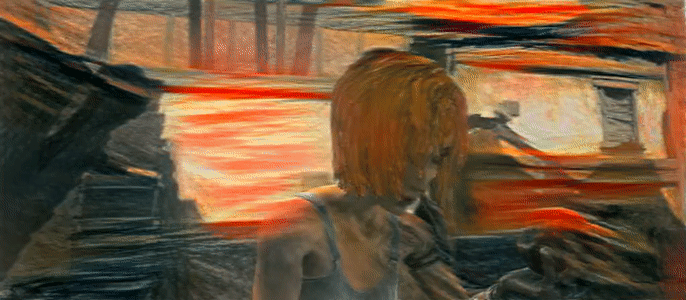
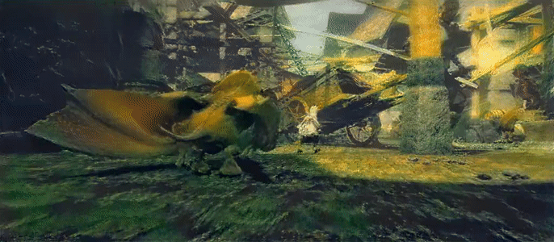

# Video-Style-Transfer

Source files of my bachelor thesis [Video Style Transfer using Inpainting Methods and Image Pyramid Integration](https://drive.google.com/open?id=13obxKTIDlgnHvIZTJUg1ld2epaQeI0Zm).

A demo file `video_style_transfer_demo.py` is provided.

## Requirements:
* Tensorflow (tested with 1.7.0)
* numpy, scipy, imageio, OpenCV3
* [imagenet VGG19 model](http://www.vlfeat.org/matconvnet/models/imagenet-vgg-verydeep-19.mat)

## Install:
After downloading the imagenet VGG19 model via the command 

    sh download_model.sh

you can run the demo file

    python video_style_transfer_demo.py

The demo just processes 5 frames of a video from the [Sintel Dataset](http://sintel.is.tue.mpg.de/) and uses pre-computed flow files which were generated using [DeepFlow2](https://thoth.inrialpes.fr/src/deepflow/).
If you want to compute your own videos you have to generate your own flow files. The script `generate_deepflow_script.py` generates a script for DeepFlow2 to automatically compute flow files for you. Before doing so please install [DeepFlow2](https://thoth.inrialpes.fr/src/deepflow/) and adjust the file `generate_deepflow_script.py` accordingly.
Alternatively you can use any other optical flow framework of your choice. In order to prevent version conflicts (Python, Tensorflow, etc.) I provide a script `network.py` that allows you to communicate between the environment of Video Style Transfer application and any other optical flow framework environment.
I have included an example file `flownet-vst.py` that shows how to use [FlowNet2](https://github.com/lmb-freiburg/flownet2) within Video Style Transfer. Since FlowNet2 uses Python 2.7 you have to run it in a separate console with a Python 2.7 environment. Before running `flownet-vst.py` you have to set `$PYTHONPATH` accordingly. For example

    export PYTHONPATH=/home/tom/Downloads/flownet2-master/python:$PYTHONPATH

In the `flownet-vst.py` file you have to modify line 23

    path_flownet = '/home/tom/Downloads/flownet2-master/models/FlowNet2/'

accordingly to your folder locations. Then you can start the main file in the first console

    python video_style_transfer_demo.py

followed by the secondary file in the second console

    python flownet-vst.py

Since optical flow is calculated in parallel to Video Style Transfer the whole process will require a lot of GPU memory in order to work!

## Example Videos
Settings: `alpha=1.0, beta=0.1, num_iter=3000, pyramid_layers=4`

Tested on Win10 and Ubuntu 16.04

